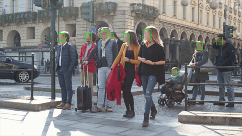

# Vision Vault – AI-Powered Face Blurring with Cryptographic Access  


## 📌 Overview  
VisionVault is an advanced computer vision application that automatically blurs faces in videos to help individuals with scopophobia while allowing authorized users to unblur them using a secure cryptographic key. This system ensures privacy, security, and controlled access to sensitive visual content, making it ideal for personal safety, surveillance, and content moderation.  


## Output
The processed video with face annotations is saved as `processed_video.mp4` in the working directory.




## 🔥 Key Features  
✅ **Real-Time Face Blurring** – AI-powered face detection for instant, seamless blurring.  
✅ **Adjustable Blur Intensity** – Users can modify the blur level based on key seed.   
✅ **Cryptographic Blurring & Reversible Encryption** – Secure facial encryption, allowing only authorized users to decrypt and view unblurred faces.  
✅ **Crowd Density Detection** – Automatically adjusts blurring based on the number of faces detected.  


## 🛠️ Tech Stack  
- **Programming Language**: Python  
- **AI/ML Models**: Retinal-Face for face detection  
- **Computer Vision**: OpenCV  
- **Cryptography**: AES-based reversible blurring  
- **Frameworks**: PyTorch  


## 📌 Use Cases
- **Scopophobia Support** – Helps individuals by obscuring distressing facial visuals.
- **Privacy & Security** – Protects identities in videos while allowing authorized access.
- **Corporate & Government Use** – Enables controlled access to surveillance footage or sensitive video content.


## 🏗️ Future Enhancements
- 🚀 **Advanced Face Recognition** – Improve face detection accuracy with additional deep learning models.
- 🔐 **Enhanced Security** – Add stronger encryption methods for face blurring and deblurring.
- 📱 **Mobile Support** – Expand usability with mobile apps for real-time video processing.
    

## 📂 Project Structure
VisionVault/             
│── data/                  
│      ├── sample.mp4             
│      ├── encryption_key.npy             
│── output/             
│      ├── processed_video.mp4             
│── process_video.py             
│── requirements.txt             
│── README.md             


## Requirements
Ensure you have the following dependencies installed:
- OpenCV (`cv2`)
- NumPy (`numpy`)
- RetinaFace (`retinaface`)

You can install them using:
```sh
pip install opencv-python numpy retinaface
```


## Usage
1. Place your video file in the working directory.
2. Ensure you have an encryption key file (`encryption_key.npy`), or modify the script accordingly.
3. Run the script with:
   ```sh
   python process_video.py
   ```


## Code Breakdown
- **Loading Encryption Key**: The script attempts to load an encryption key from a `.npy` file.
- **Reading the Video**: It opens the given video file and extracts frame properties such as width, height, and frames per second (FPS).
- **Face Detection**: Using RetinaFace, faces in each frame are detected, and bounding boxes and landmarks are drawn.
- **Saving the Processed Video**: The annotated frames are written to a new video file named `processed_video.mp4`.


## License
This project is open-source and available for modification and improvement.

## Custom Dataset
https://drive.google.com/drive/folders/1wfgyXzWDGkPZoZpFUNPdrNgyCPUq9KHE


